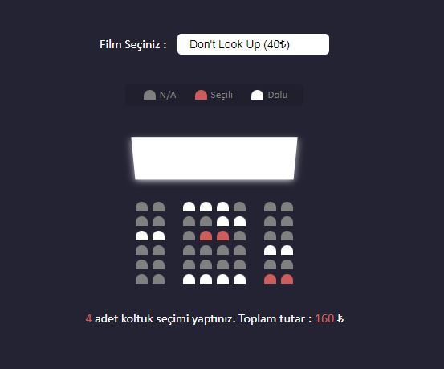

# Sinema Koltuk Rezervasyonu :

<h2>Proje Açıklaması : </h2>

Bu uygulamada bir sinema salonunun görselleştirilmiş halini tasarlayacağız. Görselimizde filmi izleyeceğimiz ekranı ve koltukları göreceğiz. Film seçeneklerimiz yer alacak, koltuklarda seçim yaparken daha önce seçilmiş olanları ya da bizimle aynı anda işlem yapılıyor ise işaretlenen koltukları görüp ona göre seçim yapabileceğiz. Son olarak seçtiğimiz koltuk adeti ve fiyatını gösteren bir açıklama ile uygulamayı sonlandıracağız.

## HTML Kısmının İçeriği : 
* Film Seçme Alanı, Koltuklarının Durum Seçeneklerinin Olduğu Alan, Koltukların Oluşturulduğu Alan ve Fiyat Bildirimin Yapıldığı Alanlarının temelini yani iskeletini oluşturduğumuz bölüm. 

## CSS Kısmının İçeriği :
* HTML ile oluşturduğumuz iskeleti şekillendirme kısmını CSS ile sağlıyoruz.
* Film seçim alanını çerçeve içerisine almak,
* Koltukların durumlarını renklendirmek, dolu olan koltukları işaretli göstermek,
* Koltukları seçmek için üzerine gittiğimizde :hover ve transform özellikleri ile ekrana yaklaştırıp büyüten özelliği kazandırmak, 
* Ekran kısmımıza transform: rotate, box-shadow ve perspective özellikleri ile 3 boyut kazandırmak gibi işlemleri burada gerçekleştiriyoruz.

## JS Kısmının İçeriği :
* Oluşturduğumuz iskelet ve süslediğimiz uygulamamız için artık hareket kazandırma zamanı ve bu işlemleri javascript ile yapıyoruz.
* Boş olan koltuklara tıklayıp seçme ve tekrardan tıkladığımızda seçimden vazgeçme özelliği kazandırıyoruz.
* Her tıkladığımız koltuk ile koltuk sayısını ve ödenecek olan para miktarını hesaplayıp, altta yer alan bölümde yazdırma özelliği kazandırıyoruz. 
* Film seçimi değiştiği zaman hesaplanan para miktarını seçilen filmin ücretine göre değiştiren özelliği kazandırıyoruz. 

## Verileri Local Storage'a Kaydetme
* Koltuk seçimlerini yaptık diyelim ve fiyat ve adet sayısı ekranda yazılıyken yanlışlıkla sayfa yenilediğimizde nereleri seçtiğimizi, hangi filmde olduğumuzu, hesaplanan para miktarını tekrar görebilmek için localStorage kısmına kaydedebiliriz.  
* Bunun için JavaScript dosyası içerisinde seçilen koltukları bir dizi içerisine kopyalayıp map vasıtasıyla yeni bir dizi indeksi döndürüyoruz. 
* Seçilen filmlerin koltukların index değerlerini ve hesaplanan toplam fiyatı localStorage kısmına eklemek için fonksiyonlarımızı oluşturuyoruz. 

## Uygulama Arayüzünü localStorage Kısmına Kaydetdiğimiz Veriler ile Doldurabilmek İçin Yapılan İşlemler 
* localStorage kısmına verileri kaydettikten sonra sayfayı yenilediğimiz zaman yapılan seçimlerin kaybolmaması için fonksiyonlar oluşturup, sayfa yenilendiğinde verileri localStorage kısmından ekrana çekme işlemi yapmasını sağlıyoruz. 
* Son olarak sayfanın aşağısına fiyatların ve adet sayılarının da localStorage kısmından ekrana aktarılması için gerekli olan fonksiyon çağırmasını yapıyoruz ve projemizi sonlandırıyoruz. 

